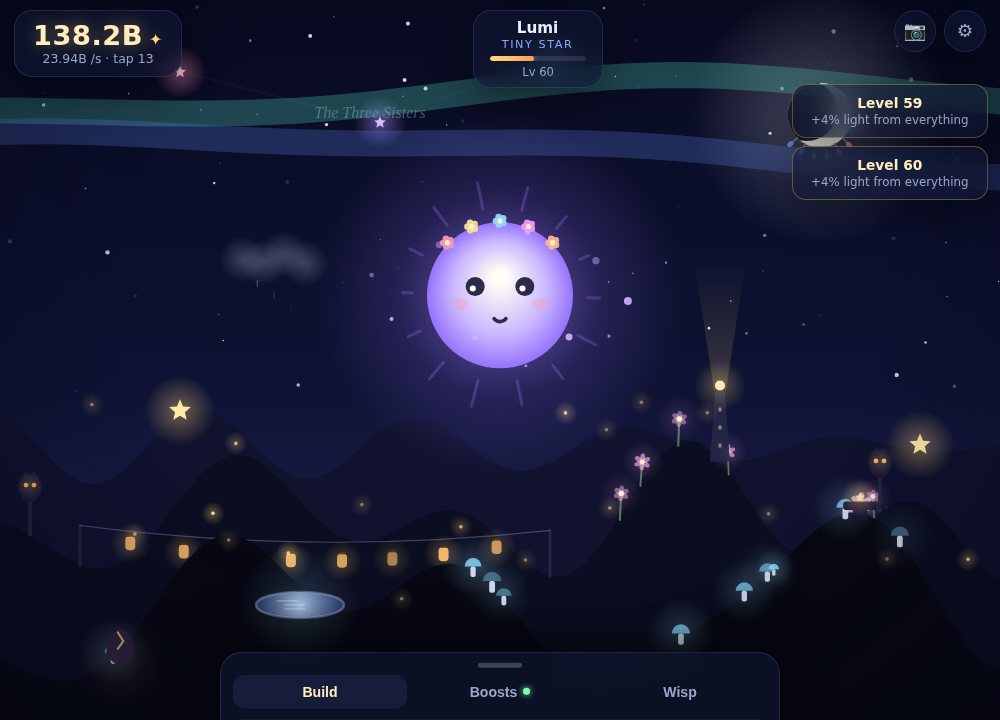
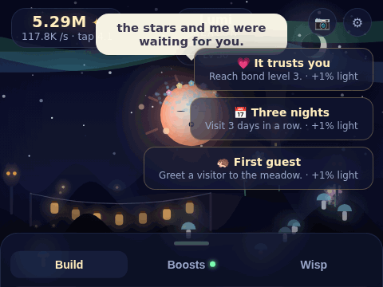
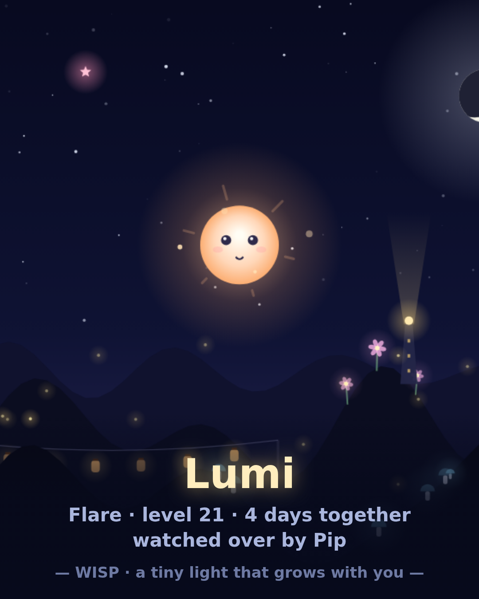
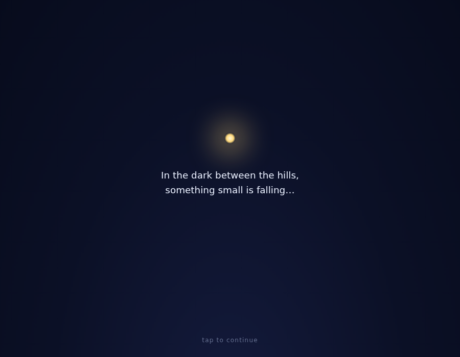
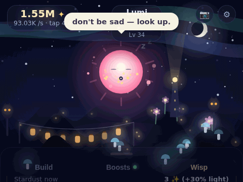

# ✦ WISP

**A tiny light that grows with you.**

WISP is a one-tab idle game. A small glowing creature falls into your hands, you give it a name, and from that moment on it's *yours* — you feed it light by touch, build it a living meadow, and one day you raise it into the sky, where it becomes a star that watches over every wisp that comes after.

It keeps gathering light while you're away. It notices when you come back.

▶ **Play:** open `index.html` in any browser — that's the whole game. No build step, no dependencies, no accounts. Works on phones, installs as an app (PWA), plays offline.



<p align="center"></p>

<p align="center"> </p>

---

## Why people stay

**It's a creature, not a counter.** Your wisp blinks, watches your cursor, squishes when you boop it, gets sleepy during your real night, says small things, and sometimes just… wants you. Hold it to pet it. The bond you build carries across every generation.

**Everything you buy is in the world.** Fireflies wander. Lanterns sway. The Ember Owl blinks on its post. The Star Anvil clinks. Every purchase is another living thing in *your* meadow — you're not raising numbers, you're building a place.

**Goodbyes become guardians.** Ascension is the prestige loop: your wisp rises, becomes a named star in your sky — permanently — and the next little light starts stronger. Raise enough of them and they form your own constellation. Tap them; they remember you. Sometimes they send blessings down.

**The world has a secret.** The Ember Owl tells one tale per day. Eighteen tales explain the long night, the sleeping sun, and what all these small raised lights are actually *for*. The lore ends where the game's hope begins: the Sun Seed.

**Kind by design.** Nothing dies. Nothing punishes. Missing a moment just means it passes. Being away is rewarded — your wisp missed you, and says so.

## The loops

| Loop | Cadence | What happens |
|---|---|---|
| Touch | seconds | tap (rhythm combos ×2), pet (hearts + bond), crits |
| Build | minutes | 14 buildings, 25 boosts, all visible in the world |
| Wish | session | 3 daily mini-goals; all three → +1 stardust |
| Grow | hours | 13 evolution stages, from Mote to Dawn |
| Events | surprise | golden dewdrops (×7 frenzy), starfall showers, comet wishes, attention moments, star blessings, drifting petals, 4 kinds of visitors |
| Return | daily | gift + streak + ×2 warmth + a new owl tale (30 tales) + weekly Moon Letters |
| Ascend | days | wisp → permanent star, stardust +10% each, rebirth ceremony, name your constellation |
| Collect | always | 49 memories (each +1% forever), 11 accessories — all earned, never bought |

## Features

- Full offline progress with a warm welcome-back (and dreams about the things *you* built)
- Daily streaks, stacking timed buffs with HUD countdown
- Wardrobe of 11 accessories — earned by loyalty milestones or supporter gift codes, never by grinding a shop
- Postcard camera 📷 — renders your meadow + wisp into a 1080×1350 share image (Web Share API / download)
- Save codes to move devices; automatic daily backup with self-healing restore; hostile save codes are sanitized
- PWA: installable, offline-capable, procedural icon
- Sky that breathes with your real clock (dawn/day/dusk/deep night) and season (snow in winter, hearts on Valentine's)
- Weather: drifting mist, petal breezes, shimmer nights — cosmetic only
- Fully synthesized audio: pentatonic taps, chimes, wind, crickets, and an optional generative music-box lullaby — zero audio files
- Everything procedural, zero sprites — with a documented renderer seam (`assets/SPRITE-GUIDE.md`) ready for a future art pass

## Tech

Vanilla JS / Canvas 2D / CSS. No dependencies, no build step. All balance and content lives in `js/config.js`.

```
index.html            manifest.webmanifest   sw.js
css/style.css         assets/icon.svg (+png)
js/
  util.js       helpers & number formatting
  config.js     ALL balance & content data (buildings, boosts, stages,
                memories, tales, voice lines, accessories, tuning)
  audio.js      synthesized sfx + night ambience
  state.js      state, save/load/migration, derived math
  particles.js  pooled particle system
  scene.js      the living meadow (procedural renderer)
  wisp.js       the creature (behaviour, face, accessories)
  ui.js         HUD, shop, toasts, modals, postcard
  game.js       tick loop, economy, events, achievements, offline
  main.js       boot, ceremonies, input
```

Deploys to GitHub Pages via `.github/workflows/pages.yml` (enable Pages → GitHub Actions in repo settings after merging to main).

## Publishing & earning

The game is a static folder — publishing is trivial:

1. **GitHub Pages (free hosting).** Merge to `main`, then repo *Settings → Pages → Source: GitHub Actions*. The included workflow deploys automatically; your game gets a public URL. Add that URL as `og:image`'s absolute prefix in `index.html` for pretty link cards.
2. **itch.io (discovery + donations).** Zip the folder, upload as an HTML game, enable "This file will be played in the browser". Set pricing to "$0 or donate". Idle games do well there.
3. **Ko-fi / Buy Me a Coffee.** Once you have a link, add a small "Support the meadow ☕" row in the settings modal (one line in `ui.js`). Keep it out of the game world.
4. **Google Play** via a TWA wrapper (Bubblewrap) once the PWA is live — WISP already meets installability requirements (manifest + service worker + icons).
5. **Cosmetics-only philosophy.** The monetization path that fits this game: a one-time supporter pack unlocking extra *cosmetic* wardrobe items and postcard frames. Never sell power, never show ads inside the meadow — trust is the retention engine.

Virality is designed in: the 📷 postcard (share image with your wisp's name and guardians), the emotional ascension moments people want to talk about, and save codes that make it safe to fall in love with a browser game.

Ready-made social material lives in `assets/screens/` (gameplay GIF, the ascension GIF below, postcard, stills) and `docs/ITCH-PAGE.md` is paste-ready store copy.

<p align="center"></p>

## Roadmap

- Weekly Moon Letters (personalized recap from the moon)
- Weather & seasons; rare visitors in the meadow
- Sprite art pass (renderer is ready)
- Cosmetic supporter pack (the monetization path: cosmetics only, never power)
- Localization (NL first)

---

*Made with a lot of love and zero sprites.*
